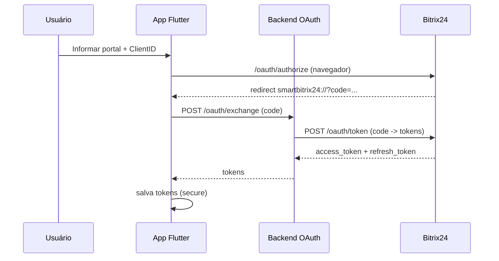
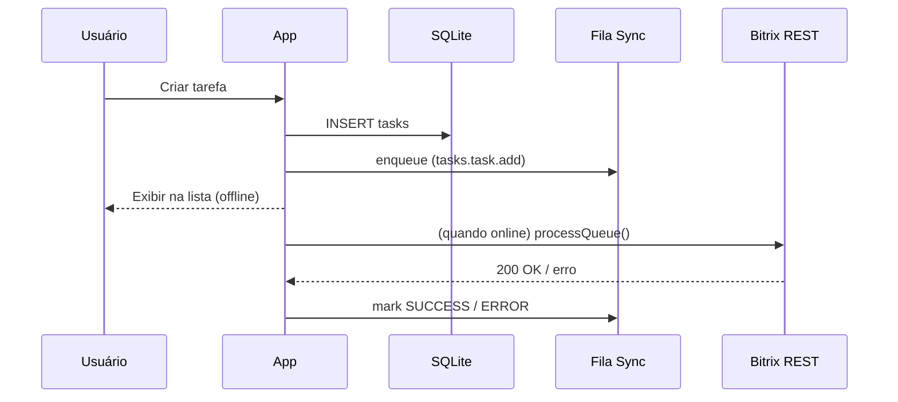

# Arquitetura - Smart Bitrix24

## Visão Geral
- App Flutter (UI/UX moderna, Material 3)
- Persistência local com SQLite (tarefas, fila de sync, perfil)
- Camada de repositórios orquestra dados locais e chamadas remotas
- Backend Node/Express para fluxo OAuth seguro (sem client secret no app)
- Sincronização resiliente (fila, retentativas, marcação de status)

## Diagrama de Componentes (Mermaid)
```mermaid
flowchart LR
  UI[UI Flutter] --> State[State (Riverpod)]
  State --> RepoTasks[TaskRepository]
  State --> RepoSync[SyncRepository]
  RepoTasks --> DB[(SQLite)]
  RepoSync --> Queue[(sync_queue)]
  RepoSync -->|Bearer Token| BitrixAPI[Bitrix REST]
  Auth[AuthService] --> SecureStorage[(Secure Storage)]
  Auth --> BackendOAuth[Backend OAuth]
  BackendOAuth --> BitrixAuth[Bitrix OAuth]
```

## Diagrama de Sequência - Login


## Diagrama de Sequência - Criação Offline e Sync


## Padrões e Princípios
- Clean-ish architecture: separação UI/Estado/Domínio/Infra
- Fail-safe: fila de sincronização e retentativas
- Segurança by design: OAuth seguro, storage protegido, HTTPS